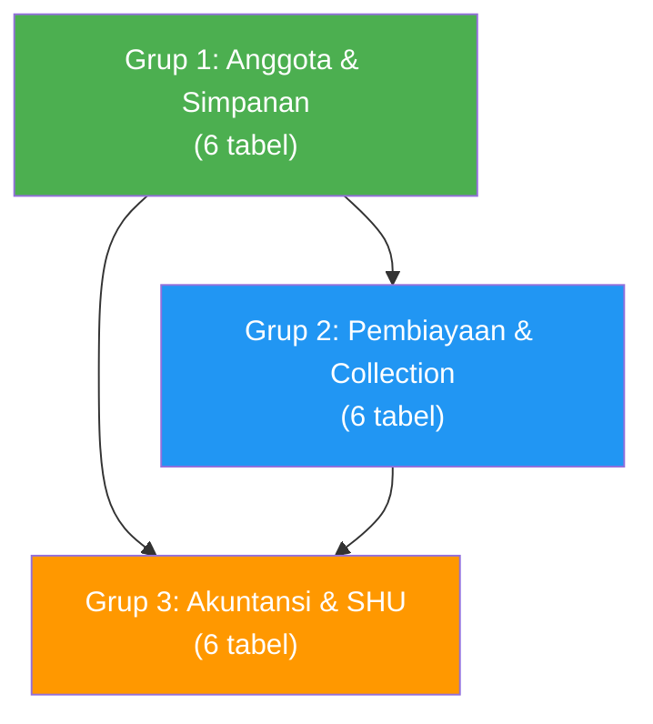
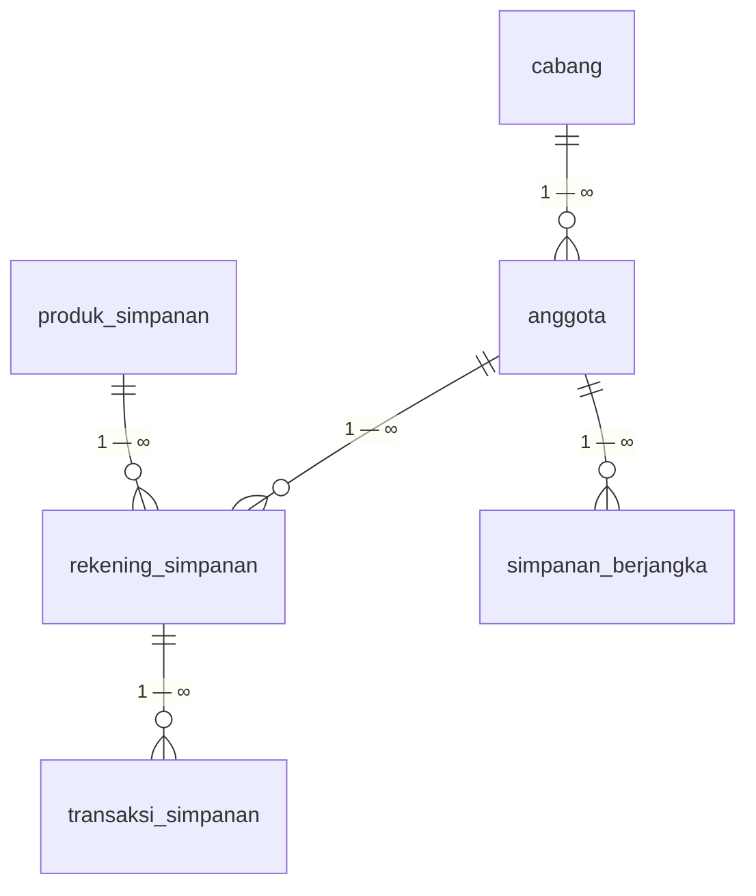
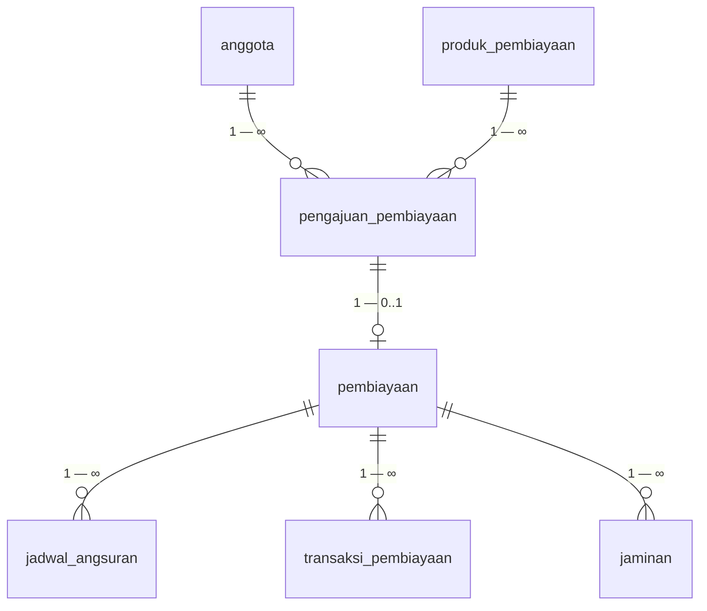
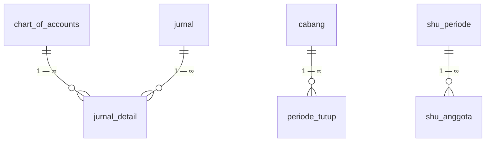
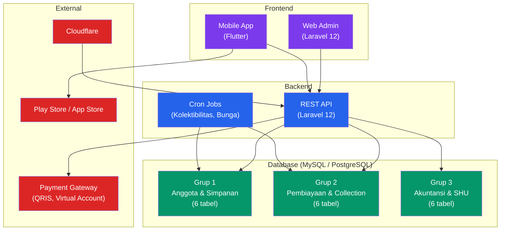

# 📋 Panduan Sistem Koperasi Digital — KopSaku

> **Sumber**: `ilovepdf_merged_signed.pdf`
> **Nomor Surat**: 001/EP/PJ-KOP/IV/2026
> **Tanggal**: 06 April 2026
> **Dari**: Elysian Project (Elian Afriliana)
> **Untuk**: Koperasi Lumbung Artha Sejahtera

---

## 📌 Ringkasan Dokumen

Dokumen ini merupakan **penawaran kerja sama pengembangan Sistem Koperasi Digital** berbasis **Web dan Mobile Applications** yang terdiri dari 2 bagian utama:

1. **Proposal Penawaran** (Halaman 1–10) — Modul, fitur, spesifikasi, dan harga
2. **Database Design** (Halaman 11–26) — Desain teknis Entity-Relationship Database v1.0

---

## 🏗️ A. Ruang Lingkup Modul

| No | Modul | Deskripsi Singkat |
|----|-------|-------------------|
| 1 | **Modul Anggota** | Master data anggota, profil, saldo, keluar, history transaksi |
| 2 | **Modul Simpanan** | Input simpanan, transaksi, pinbuk, penarikan, blokir, tutup rekening |
| 3 | **Modul Pembiayaan/Piutang** | Simulasi, pengajuan, registrasi, pencairan, angsuran, pelunasan |
| 4 | **Modul Akuntansi** | Jurnal, ledger, kas, neraca, laba rugi, buku besar |
| 5 | **Modul Inventory/Asset Management** | Master data aset, penyusutan, laporan |
| 6 | **Modul Akhir Bulan/Tahun** | Bunga simpanan, tutup buku, perhitungan & pembagian SHU |
| 7 | **Modul Sembako** | Produk, supplier, pelanggan, pembelian, penjualan, kasir, persediaan |

---

### 1. Modul Anggota
- Input master anggota
- Laporan & list data anggota
- List saldo anggota
- Proses anggota keluar + approval
- History transaksi simpanan
- Laporan: Saldo, Profil, Rekap, Anggota Keluar

### 2. Modul Simpanan
- Input & transaksi simpanan
- Approval penarikan simpanan
- Transaksi pinbuk (pemindahbukuan)
- Cancel transaksi simpanan
- Upload data simpanan
- **Laporan**: Registrasi simpanan, Penarikan, Setoran/Pinbuk, Saldo, Statement, Blokir Tabungan, Tutup Rekening, Rekap

### 3. Modul Pembiayaan/Piutang
- Simulasi pembiayaan
- Input & registrasi pengajuan
- Cetak SP3 & perjanjian kredit
- Pencairan & pelunasan
- **Transaksi**: Pencairan, Angsuran, Pelunasan
- **Laporan**: Pengajuan, Registrasi, Pembiayaan, Pencairan

### 4. Modul Akuntansi
- Transaksi akuntansi & jurnal
- Pembatalan & revisi jurnal
- Setup ledger/akun, kas, laporan
- **Laporan**: Kas, Neraca Saldo, Neraca, Laba Rugi/SHU, Jurnal, Buku Besar

### 5. Modul Inventory/Asset Management
- Master data aset
- Proses penyusutan
- Laporan data aset

### 6. Modul Akhir Bulan/Tahun
- Proses bunga simpanan
- Tutup buku bulanan & tahunan
- **SHU**: Perhitungan, Pembagian, Laporan SHU

### 7. Modul Sembako
- **Master**: Produk, Supplier, Pelanggan
- **Pembelian**: Input, Pembatalan, Laporan
- **Penjualan**: Input, Pembayaran piutang anggota, Buka/tutup kasir, Laporan
- **Persediaan**: Masuk, Keluar, Laporan
- **Akuntansi**: Transaksi, Jurnal, Pembatalan, Upload, Laporan (Neraca saldo, Neraca, Laba rugi, Jurnal, Buku besar)

---

## ⭐ B. Fitur Unggulan

### 1. Web Administrator
| Fitur | Keterangan |
|-------|------------|
| Dashboard monitoring realtime | Pinjaman karyawan, tunggakan, jumlah anggota, outstanding |
| Impor/Ekspor Excel | Bulk data management |
| Manajemen data jaminan | Termasuk foto dokumen |
| Auto posting simpanan | Otomatis posting ke jurnal |
| Validasi balance debet-kredit | Realtime validation |
| Pengaman periode tutup | Tidak bisa edit mundur setelah tutup buku |

### 2. Mobile Application
| Fitur | Keterangan |
|-------|------------|
| Push notification | Saldo bertambah & pembayaran berhasil |
| Payment gateway | QRIS & Virtual Account |
| Login | PIN 6 Digit + Biometrik |
| Dashboard saldo | Simpanan realtime |
| History transaksi | Simpanan & Angsuran |
| Tracking status | Pengajuan pembiayaan realtime |
| Distribusi | Google Play Store |
| Export laporan | PDF/Excel instan |

### 3. Infrastruktur & Keamanan
- SLA response **1x24 jam**
- **RBAC** (Role-based access control)
- **Enkripsi** data sensitif (NIK, foto KTP)
- Source code **full akses**
- **SSL/HTTPS** configured
- **Firewall** (UFW, Cloudflare)

---

## 🔧 C. Spesifikasi Teknologi

| Komponen | Tech Stack |
|----------|------------|
| Frontend + Backend | **PHP Laravel 12**, REST API |
| Mobile Apps | **Flutter** |
| Database | **MySQL** |
| Server | 8 Core CPU, 16 GB RAM, 300 GB Storage, Unlimited Traffic |

---

## 💰 D. Opsi Kerjasama & Pricing

### Opsi 1: One-Time Purchase (Beli Lisensi)

| Item | Harga | Qty | Total | Keterangan |
|------|-------|-----|-------|------------|
| Software License | Rp 73.000.000 | 1 | Rp 73.000.000 | Lifetime |
| Server | Rp 1.000.000/bln | 24 bln | Rp 24.000.000 | 2 tahun |
| Deploy Playstore | Rp 450.000 | 1 | Rp 450.000 | Lifetime |
| Staging VPS | Rp 150.000/bln | 4 bln | Rp 600.000 | 4 bulan awal |
| Deploy Appstore | Rp 1.700.000/thn | 2 thn | Rp 3.400.000 | Per tahun |
| Domain | Rp 300.000/thn | 2 thn | Rp 600.000 | Per tahun |
| **TOTAL** | | | **Rp 102.050.000** | **Biaya awal** |

> [!NOTE]
> - Free deploy Google Play Store (lifetime)
> - Sewa Cloud Server min 2 tahun, bayar di awal
> - Free maintenance 3 bulan, selanjutnya **Rp 1.500.000/bulan** (flat)
> - Free backup data bulanan

### Opsi 2: Subscription (Berlangganan)

| Item | Harga | Qty | Total | Keterangan |
|------|-------|-----|-------|------------|
| Langganan/bulan | Rp 3.500.000 | 24 bln | Rp 84.000.000 | 2 tahun |
| Server | Rp 1.000.000/bln | 24 bln | Rp 24.000.000 | 2 tahun |
| Domain | Rp 300.000/thn | 2 thn | Rp 600.000 | Per tahun |
| Maintenance | Rp 1.500.000/bln | 24 bln | Rp 36.000.000 | 2 tahun |
| Staging VPS | Rp 150.000/bln | 4 bln | Rp 600.000 | 4 bulan awal |
| Deploy Playstore | Rp 450.000 | 1 | Rp 450.000 | Lifetime |
| Deploy Appstore | Rp 1.700.000/thn | 2 thn | Rp 3.400.000 | Per tahun |
| **TOTAL** | | | **Rp 149.050.000** | **Biaya awal** |

> [!NOTE]
> - Langganan minimal 2 tahun, bayar di awal
> - Free maintenance 3 bulan pertama
> - Free backup data bulanan

### Biaya Implementasi
- **Jabodetabek**: Free
- **Luar kota**: Biaya penginapan, akomodasi, transportasi ditanggung client

### Terms of Payment
> Down payment **50%** dibayarkan maksimal **5 hari kerja** setelah penandatanganan MoU. Selebihnya mengikuti progress development.

---

## 🗄️ E. Database Design

> **Versi**: v1.0 | **Tanggal**: 1 April 2026
> **Database**: PostgreSQL 15 / MySQL 8
> **Status**: Draft — untuk review internal

Database dibagi menjadi **3 grup utama**:

---

### Grup 1 — Anggota & Simpanan (6 Tabel)

> Fondasi seluruh sistem. Tabel `anggota` menjadi pusat — semua modul lain mereferensikannya.

#### 1.1 `cabang`
Master data cabang/unit koperasi.

| Kolom | Tipe | Constraint | Keterangan |
|-------|------|------------|------------|
| id | UUID | PK | Primary key, auto-generated |
| kode | VARCHAR(10) | UNIQUE NOT NULL | Kode unik cabang, e.g. CBG-001 |
| nama | VARCHAR(100) | NOT NULL | Nama lengkap cabang |
| alamat | TEXT | | Alamat fisik kantor |
| telp | VARCHAR(20) | | Nomor telepon |
| aktif | BOOLEAN | DEFAULT true | Status operasional |
| created_at | TIMESTAMP | DEFAULT NOW() | Waktu dibuat |

#### 1.2 `anggota`
Data lengkap anggota koperasi. Field `foto_ktp` dan `foto_selfie` untuk KYC digital.

| Kolom | Tipe | Constraint | Keterangan |
|-------|------|------------|------------|
| id | UUID | PK | Primary key |
| cabang_id | UUID | FK cabang | Cabang terdaftar |
| no_anggota | VARCHAR(20) | UNIQUE NOT NULL | Nomor anggota unik |
| nik | CHAR(16) | UNIQUE NOT NULL | NIK KTP 16 digit |
| nama_lengkap | VARCHAR(150) | NOT NULL | Nama sesuai KTP |
| tempat_lahir | VARCHAR(80) | | Kota lahir |
| tanggal_lahir | DATE | NOT NULL | Tanggal lahir |
| jenis_kelamin | CHAR(1) | CHECK(L/P) | L=Laki-laki, P=Perempuan |
| alamat | TEXT | NOT NULL | Alamat domisili |
| no_hp | VARCHAR(20) | NOT NULL | Nomor HP (notifikasi WA) |
| email | VARCHAR(150) | | Email opsional |
| foto_ktp | TEXT | | Path foto KTP di object storage |
| foto_selfie | TEXT | | Path foto selfie untuk KYC |
| status | ENUM | NOT NULL | aktif / tidak_aktif / keluar / meninggal |
| tanggal_masuk | DATE | NOT NULL | Tanggal resmi jadi anggota |
| tanggal_keluar | DATE | | Diisi saat keluar/meninggal |
| created_at | TIMESTAMP | DEFAULT NOW() | Waktu dibuat |
| updated_at | TIMESTAMP | | Waktu terakhir update |

#### 1.3 `produk_simpanan`
Master produk simpanan koperasi.

| Kolom | Tipe | Constraint | Keterangan |
|-------|------|------------|------------|
| id | UUID | PK | Primary key |
| kode | VARCHAR(10) | UNIQUE NOT NULL | e.g. SIMPOK, SIMWA, SUKARELA |
| nama | VARCHAR(100) | NOT NULL | Nama produk |
| jenis | ENUM | NOT NULL | pokok / wajib / sukarela / berjangka |
| bunga_pa | DECIMAL(5,2) | DEFAULT 0 | Bunga per annum (%) |
| minimal_saldo | DECIMAL(15,2) | DEFAULT 0 | Saldo minimal |
| auto_bunga | BOOLEAN | DEFAULT false | Hitung bunga otomatis saat EOM |
| aktif | BOOLEAN | DEFAULT true | Status produk |

#### 1.4 `rekening_simpanan`
Rekening simpanan milik anggota. Satu anggota bisa punya beberapa rekening.

| Kolom | Tipe | Constraint | Keterangan |
|-------|------|------------|------------|
| id | UUID | PK | Primary key |
| anggota_id | UUID | FK anggota | Pemilik rekening |
| produk_id | UUID | FK produk_simpanan | Jenis produk |
| no_rekening | VARCHAR(30) | UNIQUE NOT NULL | Nomor rekening unik |
| saldo | DECIMAL(15,2) | DEFAULT 0 | Saldo berjalan (real-time) |
| status | ENUM | NOT NULL | aktif / blokir / tutup |
| tanggal_buka | DATE | NOT NULL | Tanggal dibuka |
| tanggal_tutup | DATE | | Diisi saat ditutup |

#### 1.5 `transaksi_simpanan`
Log setiap transaksi simpanan. Field `channel` untuk rekonsiliasi QRIS/VA.

| Kolom | Tipe | Constraint | Keterangan |
|-------|------|------------|------------|
| id | UUID | PK | Primary key |
| rekening_id | UUID | FK rekening_simpanan | Rekening terkait |
| user_id | UUID | FK users | Staff input (null jika mobile/QRIS) |
| no_transaksi | VARCHAR(30) | UNIQUE NOT NULL | Nomor transaksi unik |
| jenis | ENUM | NOT NULL | setoran / penarikan / bunga / koreksi |
| nominal | DECIMAL(15,2) | NOT NULL | Jumlah transaksi |
| saldo_sebelum | DECIMAL(15,2) | NOT NULL | Saldo sebelum (audit trail) |
| saldo_sesudah | DECIMAL(15,2) | NOT NULL | Saldo setelah |
| keterangan | TEXT | | Keterangan bebas |
| channel | ENUM | NOT NULL | teller / mobile / qris / virtual_account |
| ref_payment | VARCHAR(100) | | Reference ID payment gateway |
| created_at | TIMESTAMP | DEFAULT NOW() | **Immutable** |

#### 1.6 `simpanan_berjangka`
Deposito anggota. Accrual bunga dihitung harian.

| Kolom | Tipe | Constraint | Keterangan |
|-------|------|------------|------------|
| id | UUID | PK | Primary key |
| anggota_id | UUID | FK anggota | Pemilik deposito |
| no_deposito | VARCHAR(30) | UNIQUE NOT NULL | Nomor deposito unik |
| nominal | DECIMAL(15,2) | NOT NULL | Nominal penempatan |
| jangka_bulan | INTEGER | NOT NULL | Jangka waktu (bulan) |
| bunga_pa | DECIMAL(5,2) | NOT NULL | Bunga per annum |
| tanggal_mulai | DATE | NOT NULL | Tanggal penempatan |
| tanggal_jatuh_tempo | DATE | NOT NULL | Tanggal jatuh tempo |
| status | ENUM | NOT NULL | aktif / jatuh_tempo / cair / perpanjang |
| bunga_akrual | DECIMAL(15,2) | DEFAULT 0 | Bunga harian belum dibayar |
| last_accrual_date | DATE | | Tanggal terakhir accrual |
| auto_perpanjang | BOOLEAN | DEFAULT false | Otomatis perpanjang |

#### Relasi Grup 1

---

### Grup 2 — Pembiayaan & Collection (6 Tabel)

> [!IMPORTANT]
> Field `kolektibilitas` (1-5) di tabel `pembiayaan` **wajib untuk laporan OJK/PPAP**:
> 1=Lancar, 2=Dalam Perhatian Khusus, 3=Kurang Lancar, 4=Diragukan, 5=Macet.
> Nilai ini harus diperbarui **otomatis setiap hari via cron job** berdasarkan `hari_tunggak`.

#### 2.1 `produk_pembiayaan`
Master produk pinjaman/pembiayaan.

| Kolom | Tipe | Constraint | Keterangan |
|-------|------|------------|------------|
| id | UUID | PK | Primary key |
| kode | VARCHAR(10) | UNIQUE NOT NULL | Kode produk |
| nama | VARCHAR(100) | NOT NULL | Nama produk |
| skema_bunga | ENUM | NOT NULL | flat / efektif / anuitas |
| bunga_pa | DECIMAL(5,2) | NOT NULL | Bunga per annum default |
| max_jangka | INTEGER | | Maks jangka bulan |
| max_plafon | DECIMAL(15,2) | | Plafon maks per pengajuan |
| is_chanelling | BOOLEAN | DEFAULT false | Dana dari sumber eksternal (off-balance) |
| aktif | BOOLEAN | DEFAULT true | Status produk |

#### 2.2 `pengajuan_pembiayaan`
Dokumen pengajuan sebelum disetujui. **Tidak boleh dihapus meski ditolak.**

| Kolom | Tipe | Constraint | Keterangan |
|-------|------|------------|------------|
| id | UUID | PK | Primary key |
| anggota_id | UUID | FK anggota | Pemohon |
| produk_id | UUID | FK produk_pembiayaan | Produk yang diajukan |
| no_pengajuan | VARCHAR(30) | UNIQUE NOT NULL | Nomor pengajuan unik |
| nominal_diajukan | DECIMAL(15,2) | NOT NULL | Jumlah yang diminta |
| jangka_bulan | INTEGER | NOT NULL | Jangka yang diminta |
| tujuan | ENUM | NOT NULL | modal_kerja / konsumtif / investasi / dll |
| status_approval | ENUM | NOT NULL | pending / disetujui / ditolak / dibatalkan |
| approved_by | UUID | FK users | User yang approve/tolak |
| approved_at | TIMESTAMP | | Waktu keputusan |
| catatan | TEXT | | Catatan alasan |
| created_at | TIMESTAMP | DEFAULT NOW() | Waktu pengajuan |

#### 2.3 `pembiayaan`
Rekening pembiayaan aktif. Field `kolektibilitas` wajib untuk PPAP OJK.

| Kolom | Tipe | Constraint | Keterangan |
|-------|------|------------|------------|
| id | UUID | PK | Primary key |
| pengajuan_id | UUID | FK pengajuan | Pengajuan asal |
| anggota_id | UUID | FK anggota | Debitur |
| no_pembiayaan | VARCHAR(30) | UNIQUE NOT NULL | Nomor pembiayaan unik |
| nominal_disetujui | DECIMAL(15,2) | NOT NULL | Plafon disetujui |
| nominal_cair | DECIMAL(15,2) | NOT NULL | Jumlah dicairkan |
| jangka_bulan | INTEGER | NOT NULL | Jangka pembiayaan |
| bunga_pa | DECIMAL(5,2) | NOT NULL | Bunga per annum |
| metode_hitung | ENUM | NOT NULL | flat / efektif / anuitas |
| angsuran_pokok | DECIMAL(15,2) | NOT NULL | Angsuran pokok/bulan |
| angsuran_bunga | DECIMAL(15,2) | NOT NULL | Angsuran bunga/bulan (flat) |
| tanggal_akad | DATE | NOT NULL | Tanggal akad |
| tanggal_cair | DATE | | Tanggal pencairan |
| tanggal_lunas | DATE | | Diisi saat lunas |
| status | ENUM | NOT NULL | aktif / lunas / macet / hapus_buku |
| saldo_pokok | DECIMAL(15,2) | NOT NULL | Sisa pokok terutang |
| saldo_bunga | DECIMAL(15,2) | DEFAULT 0 | Bunga belum dibayar |
| hari_tunggak | INTEGER | DEFAULT 0 | Hari keterlambatan |
| kolektibilitas | SMALLINT | CHECK(1-5) | 1–5 (lihat keterangan) |
| is_chanelling | BOOLEAN | DEFAULT false | Off-balance-sheet |
| sumber_dana | VARCHAR(100) | | Nama lembaga sumber dana |

#### 2.4 `jadwal_angsuran`
Jadwal angsuran per bulan, di-generate saat pencairan. **Tidak boleh diubah manual.**

| Kolom | Tipe | Constraint | Keterangan |
|-------|------|------------|------------|
| id | UUID | PK | Primary key |
| pembiayaan_id | UUID | FK pembiayaan | Pembiayaan induk |
| ke | INTEGER | NOT NULL | Urutan angsuran ke-N |
| tanggal_jatuh_tempo | DATE | NOT NULL | Tanggal jatuh tempo |
| pokok | DECIMAL(15,2) | NOT NULL | Komponen pokok |
| bunga | DECIMAL(15,2) | NOT NULL | Komponen bunga |
| total | DECIMAL(15,2) | NOT NULL | Total bayar |
| saldo_akhir | DECIMAL(15,2) | NOT NULL | Saldo pokok setelah angsuran |
| status | ENUM | NOT NULL | belum / lunas / terlambat |
| tanggal_bayar | DATE | | Tanggal aktual bayar |

#### 2.5 `transaksi_pembiayaan`
Log transaksi pembayaran. **Immutable — tidak boleh di-update.**

| Kolom | Tipe | Constraint | Keterangan |
|-------|------|------------|------------|
| id | UUID | PK | Primary key |
| pembiayaan_id | UUID | FK pembiayaan | Pembiayaan terkait |
| jadwal_id | UUID | FK jadwal_angsuran | Jadwal yang dibayar (null untuk realisasi) |
| no_transaksi | VARCHAR(30) | UNIQUE NOT NULL | Nomor transaksi |
| jenis | ENUM | NOT NULL | angsuran / realisasi / pelunasan / denda |
| nominal_pokok | DECIMAL(15,2) | NOT NULL | Komponen pokok |
| nominal_bunga | DECIMAL(15,2) | NOT NULL | Komponen bunga |
| nominal_denda | DECIMAL(15,2) | DEFAULT 0 | Denda keterlambatan |
| total | DECIMAL(15,2) | NOT NULL | Total dibayar |
| channel | ENUM | NOT NULL | teller / mobile / qris / virtual_account |
| ref_payment | VARCHAR(100) | | Reference payment gateway |
| created_at | TIMESTAMP | DEFAULT NOW() | **Immutable** |

#### 2.6 `jaminan`
Aset jaminan untuk pembiayaan. Satu pembiayaan bisa punya beberapa jaminan.

| Kolom | Tipe | Constraint | Keterangan |
|-------|------|------------|------------|
| id | UUID | PK | Primary key |
| pembiayaan_id | UUID | FK pembiayaan | Pembiayaan terkait |
| jenis_jaminan | ENUM | NOT NULL | tanah / kendaraan / bpkb / sk_kerja / dll |
| deskripsi | TEXT | NOT NULL | Deskripsi detail aset |
| nilai_taksasi | DECIMAL(15,2) | | Nilai taksasi koperasi |
| no_dokumen | VARCHAR(80) | | Nomor sertifikat/BPKB/dll |
| foto_dokumen | TEXT | | Path foto dokumen |

#### Relasi Grup 2

---

### Grup 3 — Akuntansi & SHU (6 Tabel)

> [!IMPORTANT]
> Sistem **double-entry**: setiap transaksi di modul simpanan dan pembiayaan harus **otomatis menghasilkan record jurnal** via `ref_id` + `ref_tabel`.
> Validasi balance `SUM(debet) = SUM(kredit)` harus dilakukan di **level database constraint**.

#### 3.1 `chart_of_accounts`
Bagan akun koperasi. Mendukung hierarki dan multi-cabang.

| Kolom | Tipe | Constraint | Keterangan |
|-------|------|------------|------------|
| id | UUID | PK | Primary key |
| cabang_id | UUID | FK cabang | null = konsolidasi |
| kode_akun | VARCHAR(10) | NOT NULL | e.g. 11010 |
| nama_akun | VARCHAR(150) | NOT NULL | Nama akun |
| kelompok | ENUM | NOT NULL | aset / liabilitas / ekuitas / pendapatan / beban |
| posisi_normal | ENUM | NOT NULL | debet / kredit |
| is_header | BOOLEAN | DEFAULT false | True = akun grup |
| parent_id | UUID | FK self | Akun induk (hierarki) |
| aktif | BOOLEAN | DEFAULT true | Status akun |

> **Kode numerik standar**: 1xxxx Aset, 2xxxx Liabilitas, 3xxxx Ekuitas, 4xxxx Pendapatan, 5xxxx Beban

#### 3.2 `jurnal`
Header jurnal akuntansi. Auto-posting dari modul simpanan/pembiayaan.

| Kolom | Tipe | Constraint | Keterangan |
|-------|------|------------|------------|
| id | UUID | PK | Primary key |
| cabang_id | UUID | FK cabang | Cabang pembuat |
| no_jurnal | VARCHAR(30) | UNIQUE NOT NULL | Nomor jurnal unik per cabang |
| tanggal | DATE | NOT NULL | Harus di periode belum ditutup |
| keterangan | TEXT | NOT NULL | Deskripsi transaksi |
| jenis | ENUM | NOT NULL | otomatis / manual / eliminasi / koreksi |
| ref_id | UUID | | ID record sumber |
| ref_tabel | VARCHAR(80) | | Nama tabel sumber |
| dibuat_oleh | UUID | FK users | User pembuat |
| is_eliminasi | BOOLEAN | DEFAULT false | Eliminasi antar cabang |
| is_reversed | BOOLEAN | DEFAULT false | Sudah di-reverse? |
| reversed_by | UUID | FK self | ID jurnal pembalik |
| created_at | TIMESTAMP | DEFAULT NOW() | **Immutable** |

#### 3.3 `jurnal_detail`
Baris debet/kredit jurnal. Min 2 baris per jurnal. `SUM(debet) = SUM(kredit)` per jurnal.

| Kolom | Tipe | Constraint | Keterangan |
|-------|------|------------|------------|
| id | UUID | PK | Primary key |
| jurnal_id | UUID | FK jurnal | Jurnal induk |
| akun_id | UUID | FK chart_of_accounts | Akun yang diposting |
| debet | DECIMAL(15,2) | DEFAULT 0 | Jumlah debet |
| kredit | DECIMAL(15,2) | DEFAULT 0 | Jumlah kredit |
| keterangan | TEXT | | Keterangan baris (opsional) |

#### 3.4 `periode_tutup`
Pengaman periode akuntansi. **WAJIB dicek sebelum setiap insert jurnal.**

| Kolom | Tipe | Constraint | Keterangan |
|-------|------|------------|------------|
| id | UUID | PK | Primary key |
| cabang_id | UUID | FK cabang | Cabang |
| tahun | INTEGER | NOT NULL | Tahun periode |
| bulan | INTEGER | NOT NULL | 1-12 |
| is_closed | BOOLEAN | DEFAULT false | Status tutup buku |
| closed_at | TIMESTAMP | | Waktu ditutup |
| closed_by | UUID | FK users | User penutup |

#### 3.5 `shu_periode`
SHU per tahun buku. **Harus finalized sebelum distribusi.**

| Kolom | Tipe | Constraint | Keterangan |
|-------|------|------------|------------|
| id | UUID | PK | Primary key |
| cabang_id | UUID | FK cabang | Cabang |
| tahun | INTEGER | NOT NULL | Tahun buku |
| total_shu | DECIMAL(15,2) | NOT NULL | Total SHU bersih setelah pajak |
| shu_cadangan | DECIMAL(15,2) | NOT NULL | Porsi cadangan koperasi |
| shu_anggota | DECIMAL(15,2) | NOT NULL | Porsi dibagikan ke anggota |
| shu_pengurus | DECIMAL(15,2) | NOT NULL | Honorarium pengurus |
| shu_karyawan | DECIMAL(15,2) | NOT NULL | Bonus karyawan |
| status | ENUM | NOT NULL | draft / finalized |
| finalized_at | TIMESTAMP | | Waktu finalisasi |

#### 3.6 `shu_anggota`
Rincian SHU per anggota. Dihitung dari jasa simpanan + jasa pinjaman.

| Kolom | Tipe | Constraint | Keterangan |
|-------|------|------------|------------|
| id | UUID | PK | Primary key |
| shu_periode_id | UUID | FK shu_periode | SHU periode terkait |
| anggota_id | UUID | FK anggota | Anggota penerima |
| jasa_simpanan | DECIMAL(15,2) | NOT NULL | SHU dari kontribusi simpanan |
| jasa_pinjaman | DECIMAL(15,2) | NOT NULL | SHU dari kontribusi pinjaman |
| total_shu | DECIMAL(15,2) | NOT NULL | Total SHU anggota |
| status_bayar | ENUM | NOT NULL | belum / sudah / dialihkan |
| dibayar_at | TIMESTAMP | | Waktu dibayarkan |

#### Relasi Grup 3

---

## 🔒 F. Konvensi & Catatan Implementasi

| Aspek | Aturan |
|-------|--------|
| **Primary Key** | UUID v4 — jangan auto-increment (aman multi-cabang, tidak bocorkan jumlah record) |
| **Soft Delete** | Tidak ada hard delete. Gunakan field `status` atau `aktif=false`. Data keuangan tidak boleh dihapus permanen |
| **Immutability** | Tabel transaksi tidak boleh di-UPDATE setelah `created_at`. Koreksi via transaksi pembalik baru |
| **Timestamp** | Semua UTC. Konversi ke WIB (UTC+7) hanya di layer presentasi |
| **Desimal** | `DECIMAL(15,2)` untuk semua nilai uang — **jangan FLOAT/DOUBLE** (presisi) |
| **Index** | Wajib: `anggota.no_anggota`, `anggota.nik`, `rekening_simpanan.no_rekening`, `pembiayaan.no_pembiayaan`, `jurnal.tanggal+cabang_id`, semua FK yang sering di-JOIN |
| **Migrasi Data** | Validasi `SUM(saldo rekening_simpanan) = SUM(saldo di sistem lama)` sebelum go-live |
| **Backup** | `pg_dump` / `mysqldump` setiap hari pukul 01:00 WIB. Simpan 30 hari di object storage terpisah |

> [!CAUTION]
> Dokumen ini merupakan desain awal dan dapat berubah sesuai kebutuhan implementasi. Setiap perubahan skema database setelah go-live harus melalui proses **migration script yang terdokumentasi**.

---

## 📊 Ringkasan Arsitektur Keseluruhan

---

## ✅ Checklist Implementasi

- [ ] Setup project Laravel 12
- [ ] Setup database MySQL/PostgreSQL
- [ ] Buat migration untuk Grup 1 (Anggota & Simpanan — 6 tabel)
- [ ] Buat migration untuk Grup 2 (Pembiayaan & Collection — 6 tabel)
- [ ] Buat migration untuk Grup 3 (Akuntansi & SHU — 6 tabel)
- [ ] Implementasi RBAC (Role-based access control)
- [ ] Implementasi REST API endpoints
- [ ] Setup cron jobs (kolektibilitas, bunga harian, accrual)
- [ ] Integrasi Payment Gateway (QRIS, Virtual Account)
- [ ] Build Mobile App (Flutter)
- [ ] Setup server & infrastruktur
- [ ] Konfigurasi SSL, Firewall (UFW, Cloudflare)
- [ ] Setup backup otomatis (01:00 WIB)
- [ ] Deploy ke Play Store & App Store
- [ ] UAT & migrasi data dari sistem lama
- [ ] Go-live

Kamu ada 3 akun terdaftar. Switch pake:
gh auth switch -u srtcreativedesign-web
gh auth switch -u elianafriliana9-eng
Atau untuk login akun baru:
gh auth login